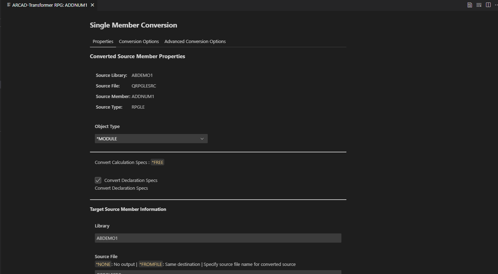

# Working with Transformer RPG

### Conversion Options

The **Arcad Transformer-RPG** extension allows you to convert RPG files to a fully free format or add them to a conversion list for later batch processing.

---

## **Convert to Fully Free**

You can convert a **single member** or **all members** of a source file to the fully free format.

### **1. Convert a Single Member**
1. Right-click an RPGLE **member** in the **Code for IBM i Object Explorer**.
2. Select **Convert to Fully Free**.

   

3. The **Configuration Panel** will appear:
   - **Target Library**: The default library is pre-selected. Modify it as needed.
   - **Conversion Options**: Customize additional settings like target format.
   

4. Click **Convert** to convert the selected member to a fully free format.
   - Or, click **Convert & Save** to convert and save the configuration for future use.

### **2. Convert All Members of a Source File**
1. Right-click an RPGLE **source file** in the **Code for IBM i Object Explorer**.
2. Select **Convert to Fully Free**.
3. The **Configuration Panel** will appear, applying to all members in the source file.
4. After reviewing and adjusting settings, click **Convert** to convert all members of the source file to fully free format.
5. The Process will fetch the Object type of the source members and convert them to fully free format.

---
